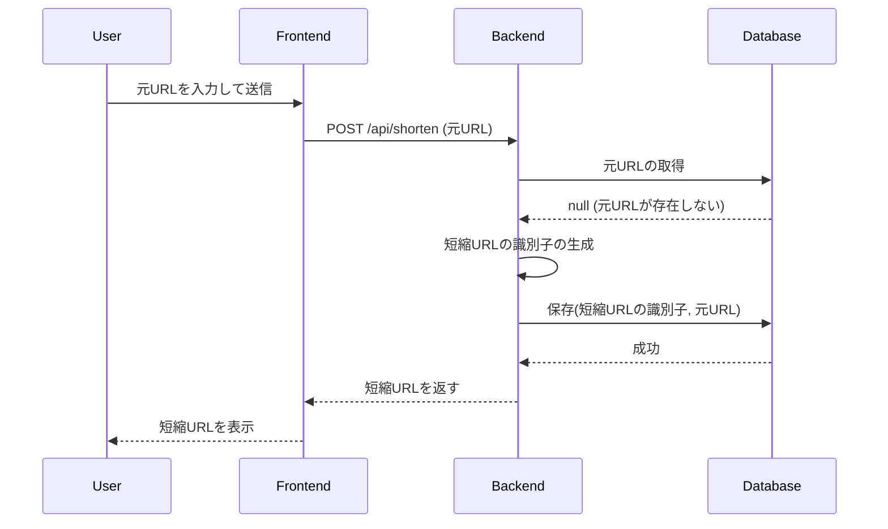
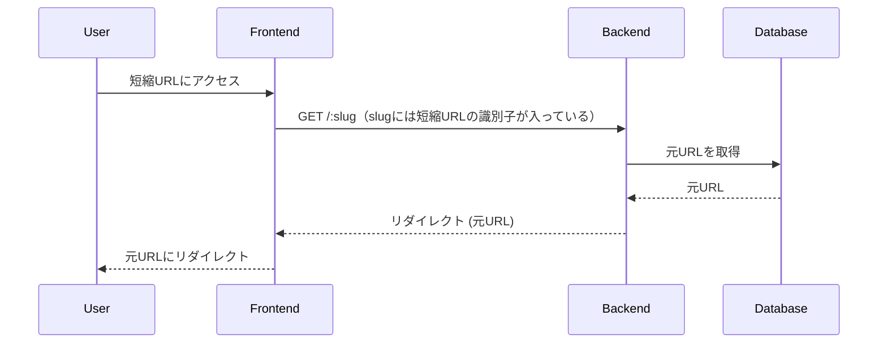

# ADR: URL短縮サービスのシステムのシステムアーキテクチャ

## コンテキスト
### 目的
本URL短縮サービスの作成目的は
- 技術面接でURL短縮サービスが題材になった時に、対応のための勘どころがわかるようにするため
- 実際に操作できるデモを構築する能力の向上のため
- モダンフロントエンドの体験のため
### 方針
- なるべく最小コストで実装できるようにする
- 変更時の影響範囲が小さくなるように、コンポーネントは適切に分割する
- ユニットテストを書く
- ADRを書く

## 決定
### フロントエンド
- `Remix`を使用する
- 理由
  - 元URLの入力のためのGUIのフォームを用意したかった
  - `Next.js`は学習コストが高そうだったので、今回は除外した
### バックエンド
- `Remix`を使用する
- 理由
  - トータルの実装コストをなるべく低くするため
    - フロントエンドと同じ技術を採用することで、複数リポジトリを作ることなくサービスを構築できると判断
### データベース
- `SQLite`を使用する
- 理由
  - 最も構築コストが低いデータベースだと判断したため
### テスト
- `Vitest`を使用する
- 理由
  - なんとなく名前を聞いたことがあって、使ってみたかったから

## アーキテクチャ概要

### シーケンス

#### URL短縮の生成

#### 短縮URLから元URLのリダイレクト

### 主要ファイルについて
#### フロントエンド
- `_index.tsx`
  - ユーザーが短縮する元URLを入力できるメインページ
#### バックエンド
- `server.ts`
  - 環境変数の読み込み
- `shorten.ts`
  - 短縮URLを作成するためのAPIエンドポイント
- `ShortenUrlService`
  - 短縮URLの生成と取得を担当
- `UrlMapping`
  - SQLiteデータベースとやり取りするリポジトリ

### 環境変数
`.env.example`を参照

## 結果

### 利点
- URL短縮サービスの基本機能を実現
- サービスの実装コストが最小限

### 欠点
- 実際に外部に公開するサービスできるレベルの性能は発揮できない
  - DBをもっと性能が出る別のものに置き換える必要がある
